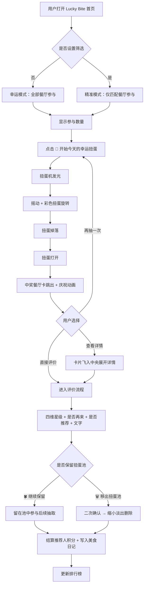
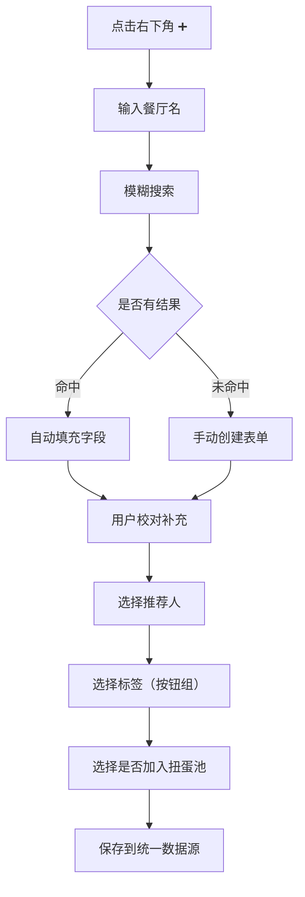

# Lucky Bite 产品需求文档（PRD）

## 1. 产品概述

Lucky Bite 是一款将"今天吃什么"这一日常决策扭转化为扭蛋游戏体验的 Progressive Web App（PWA）应用。它让朋友们共同维护一个共享餐厅池，把每一次聚餐都变成一次幸运抽取仪式，让餐厅推荐沉淀为长期美食记忆与积分成就。

- **目标用户**：年轻吃货群体、朋友圈聚餐组织者、注重情绪价值与社交体验的伙伴
- **核心价值**：用游戏感取代工具感，在还没开始吃之前就先制造快乐；通过推荐人积分与排行榜形成持续竞争机制
- **平台定位**：可安装到 iOS / Android / iPad / Desktop 主屏的 PWA，移动端体验接近原生 App

## 2. 核心功能

### 2.1 用户角色

| 角色 | 加入方式 | 核心权限 |
|------|----------|----------|
| 房主（小队创建者） | 创建房间 + 昵称 + 头像 | 邀请玩家、管理小队、推荐餐厅、参与抽取、评价餐厅、查看排行榜与日记 |
| 玩家（小队成员） | 邀请码加入 + 昵称 + 头像 | 推荐餐厅、参与抽取、评价餐厅、查看个人资料/排行榜/日记 |

> V1 不强制手机号登录。预留手机号 / Apple / Google / 微信登录接口。

### 2.2 功能模块

1. **首页（游戏大厅）**：动态背景 + 左右持续滚动餐厅卡 + 中央扭蛋机 + 今日冠军 + 右下角新增入口
2. **今天想吃什么（筛选系统）**：菜系/地区/预算/午市/晚市/营业时间/场合/排队时间/是否需预约/标签
3. **扭蛋抽取**：3 秒仪式感动画、幸运模式（无筛选）/ 精准模式（有筛选）、参与数量提示
4. **餐厅详情浮层**：卡片飞入屏幕中央放大展开，完整信息 + 操作按钮
5. **新增餐厅**：智能模糊搜索（中文/拼音/英文/关键词/连锁）→ 自动填充 → 失败回退手动创建
6. **餐厅编辑 / 删除**：全字段可编辑；删除需二次确认 + 缩小淡出动画
7. **Food Party 玩家系统**：创建小队、邀请码加入、玩家资料卡（昵称/头像/加入日期/推荐数/体验数/积分/等级/徽章/历史评价/收藏）
8. **推荐人系统**：新增餐厅必选推荐人；单人时默认自己；永久保存
9. **推荐积分系统**：体验后按平均分自动结算（5★+10 / 4★+7 / 3★+3 / 2★-2 / 1★-5），规则可配置不写死
10. **餐厅评价系统**：菜品/环境/服务/性价比四维星级 + 是否再来 + 是否推荐 + 文字感受（预留图片）
11. **是否保留扭蛋池**：评价后二选一（🍀 继续保留 / 🗑 移出扭蛋池），移出需再次确认
12. **美食日记**：每次体验自动生成一篇手账风时间轴日记
13. **排行榜**：周/月/季/全部，前三名 🥇🥈🥉，冠军 👑 美食大王 + 皇冠彩带动画；首页展示今日/本月最佳推荐人
14. **数据持久化**：LocalStorage / IndexedDB，Repository 模式抽象，预留数据库迁移

### 2.3 页面详情

| 页面名称 | 模块名称 | 功能描述 |
|----------|----------|----------|
| 首页（游戏大厅） | 动态背景 | 云朵/星星/食物图标/闪光/气泡缓慢漂浮 |
| 首页（游戏大厅） | 左右餐厅卡滚动 | 双列无限纵向滚动，pastel 多色卡片 |
| 首页（游戏大厅） | 中央扭蛋机 | 大型日式扭蛋机 + 主 CTA「🎲 开始今天的幸运扭蛋」+ 呼吸动画 |
| 首页（游戏大厅） | 今日冠军 | 顶部展示今日/本月最佳推荐人卡片 |
| 首页（游戏大厅） | 右下角 FAB | ➕ 新增餐厅入口 |
| 今天想吃什么（筛选浮层） | 筛选项 | 菜系/地区/预算/午市/晚市/营业/场合/排队/预约/标签，全部可选 |
| 今天想吃什么（筛选浮层） | 模式提示 | 显示「本次共有 XX 家餐厅参与扭蛋」+ 幸运/精准模式标识 |
| 扭蛋抽取动画 | 流程 | 发光 → 摇动 → 旋转 → 掉落 → 打开 → 餐厅卡跳出 → 庆祝 |
| 扭蛋结果 | 结果展示 | 中奖餐厅卡片 + 操作（详情/再抽一次/保留/移出） |
| 餐厅详情浮层 | 信息区 | 封面/名称/菜系/地址/地区/营业/人均/评分/地图/标签/推荐人/推荐来源 |
| 餐厅详情浮层 | 操作区 | 🍀 返回扭蛋池 / ❤️ 收藏 / 📝 评价 / ➕ 加评价 / 🗑 删除 |
| 新增餐厅页 | 智能搜索 | 模糊搜索 + 自动填充 |
| 新增餐厅页 | 手动表单 | 名称/菜系/地区/地址/营业/午市/晚市/人均/推荐人/来源/理由/标签/备注/是否入池 |
| 标签选择器 | 按钮组 | 中餐/粤菜/川菜/湘菜/火锅/烧烤/日料/韩餐/西餐/东南亚/咖啡/甜品/Brunch/下午茶/酒吧/约会/闺蜜/家庭/聚餐/一个人/庆祝/拍照/安静/热闹/高级/烟火气/排队王/隐藏小店 |
| Food Party 页 | 小队管理 | 创建房间/邀请码/成员列表/退出小队 |
| 玩家资料页 | 资料卡 | 头像/昵称/加入日期/推荐数/体验数/积分/等级/徽章/历史/收藏 |
| 评价页 | 星级评分 | 菜品/环境/服务/性价比四维逐颗点亮 |
| 评价页 | 选择项 | 是否再来 / 是否推荐 |
| 评价页 | 文字感受 | 自由输入（预留图片） |
| 评价结束页 | 去留决策 | 🍀 继续保留 / 🗑 移出扭蛋池（二次确认） |
| 美食日记页 | 时间轴 | 手账风卡片：日期/餐厅/参与人/评价/评分/推荐人/感受 |
| 排行榜页 | 榜单 | 周/月/季/全部切换，前三 + 冠军皇冠动画 |

## 3. 核心流程

### 3.1 扭蛋抽取主流程

用户进入首页 → （可选）打开「今天想吃什么」筛选 → 选择菜系/地区/预算等 → 点击「🎲 开始今天的幸运扭蛋」→ 扭蛋机发光摇动旋转（约 3s）→ 扭蛋掉落打开 → 中奖餐厅卡跳出 + 庆祝动画 → 用户选择（查看详情 / 再抽一次 / 评价 / 保留 / 移出）。

### 3.2 新增餐厅流程

点击右下角 ➕ → 输入餐厅名 → 系统模糊搜索（中文/拼音/英文/关键词/连锁）→ 命中则自动填充全部字段 → 用户校对补充 → 选择推荐人（单人时默认自己）→ 选择标签（按钮组）→ 选择是否加入扭蛋池 → 保存。

### 3.3 评价与去留流程

抽取或从详情进入评价 → 菜品/环境/服务/性价比逐颗点亮 → 选择是否再来 → 选择是否推荐 → 输入文字感受 → 提交 → 系统计算平均分 → 自动结算推荐人积分 → 弹出去留决策 → 选择保留或移出（移出需二次确认）→ 写入美食日记 + 更新排行榜。

## 4. 用户界面设计

### 4.1 设计风格

**视觉关键词**：可爱 / 治愈 / 柔软 / 友好 / 俏皮 / 任天堂风 / 高级感

**主色板（柔和马卡龙系）**：
- 天空蓝 `#A8D8F0`（主色）
- 奶油白 `#FFF8EC`（背景）
- 浅粉 `#FFD6E0`（强调）
- 奶油黄 `#FFE9A8`（点缀）
- 薄荷绿 `#BDEBD0`（成功/正向）
- 薰衣草 `#D9C8F0`（次级强调）

**禁止**：重灰界面、Excel 列表、企业 UI、尖锐直角、暗色企业主题。

**按钮风格**：大圆角（16-24px）、3D 凸起柔光阴影、点击时轻微缩小反馈、pastel 配色。

**字体**：现代中文字体（推荐 LXGW WenKai / 思源黑体 / 阿里巴巴普惠体），明确层级（标题/正文/辅助），按钮与卡片全部圆角。

**图标**：统一使用 Lucide Icons，不混用其他图标库。配合 emoji 表情符号增强游戏感（🎲🍀❤️📝➕🗑🥇🥈🥉👑🏆✨）。

**布局**：卡片式、漂浮卡片、轻玻璃拟态、柔和阴影、流畅过渡。

**动画统一风格**（200-500ms）：
- 渐隐渐现 / 卡片缩放 / 滑入滑出 / 毛玻璃过渡
- 扭蛋机持续呼吸动画
- 左右餐厅卡持续纵向滚动
- 背景缓慢漂浮动画
- 按钮点击轻微缩小
- 卡片点击放大飞入中央、关闭返回原位
- 评分星星逐颗点亮、数字缓慢增长
- 排行榜冠军头像上升 + 皇冠 + 彩带
- 删除卡片缓慢缩小淡出

### 4.2 页面设计概览

| 页面名称 | 模块名称 | UI 元素 |
|----------|----------|----------|
| 首页（游戏大厅） | 动态背景 | 漂浮云朵/星星/食物图标/sparkle/气泡，缓慢柔和动画 |
| 首页（游戏大厅） | 左侧餐厅卡列 | 双列无限纵向滚动，pastel 多色，封面+名称+菜系+地区+人均+状态+推荐人 |
| 首页（游戏大厅） | 中央扭蛋机 | 大型日式扭蛋机玻璃球 + 主 CTA + 呼吸光晕 |
| 首页（游戏大厅） | 右侧餐厅卡列 | 同左侧反向滚动 |
| 首页（游戏大厅） | 今日冠军卡 | 顶部 🏆 + 头像 + 昵称 + 积分 |
| 首页（游戏大厅） | 右下角 FAB | 圆形 ➕ 漂浮按钮，pastel 配色 |
| 今天想吃什么 | 筛选浮层 | 毛玻璃背景 + 圆角卡片 + 按钮组 + 参与数量提示 |
| 扭蛋动画 | 全屏遮罩 | 扭蛋机放大 + 发光 + 摇动 + 彩色扭蛋旋转 + 掉落 + 打开 + 庆祝彩带 |
| 餐厅详情浮层 | 浮层 | 卡片飞入放大 + 毛玻璃 + 完整信息 + 圆角按钮组 |
| 新增餐厅页 | 搜索区 | 大圆角输入框 + 实时模糊搜索结果列表 |
| 新增餐厅页 | 表单区 | 圆角输入 + 标签按钮组 + 推荐人选择 + 开关 |
| 评价页 | 星级区 | 四行五星，逐颗点亮动画 |
| 评价页 | 决策区 | 是否再来 / 是否推荐 大按钮 + 文字框 |
| 美食日记页 | 时间轴 | 手账风卡片 + 胶带贴纸 + 日期/餐厅/评分/推荐人 |
| 排行榜页 | 榜单 | 前三领奖台 + 冠军皇冠彩带 + 切换 Tab |
| 玩家资料页 | 资料卡 | 大头像 + 等级 + 徽章墙 + 数据统计 |

### 4.3 响应式

- **桌面端**：三列布局（左餐厅卡 + 中扭蛋机 + 右餐厅卡）
- **iPad / 平板**：保持三列或两列（餐厅卡列收窄）
- **手机竖屏**：单列布局，扭蛋机居中，餐厅卡改为顶部/底部横向滚动条或可隐藏抽屉
- **手机横屏**：紧凑两列，保证扭蛋机可见
- 触控优化：所有按钮 ≥44px 触摸区，点击反馈动画
- 不出现布局错位、文字溢出、按钮重叠

### 4.4 PWA 要求

- 完整 manifest（name / short_name / icons / start_url / display:standalone / background_color / theme_color / orientation）
- App Icon（多尺寸 192/512/maskable）
- Splash Screen（启动画面）
- Install Prompt（安装提示）
- Service Worker + Offline Cache（基础离线可用）
- Mobile Fullscreen（display:standalone）
- 支持 Android / iPhone / iPad / Desktop 安装到主屏

### 4.5 后续可扩展能力（预留接口，不在 V1 实现）

AI 推荐餐厅、根据天气/人数推荐、地图模式、自动同步大众点评/小红书收藏、自动识别餐厅截图、自动补全餐厅信息、每月美食报告、年度回顾、分享长图、成就系统、勋章系统、节日活动、限时挑战、连续打卡奖励、幸运值系统、今日签到。

## 5. V1 开发范围（强制完成）

- ✅ 首页（动态背景 + 左右滚动餐厅卡 + 中央扭蛋机）
- ✅ 今天想吃什么（筛选系统）
- ✅ 幸运模式 / 精准模式
- ✅ 扭蛋抽取餐厅
- ✅ 餐厅详情页
- ✅ 新增餐厅（模糊搜索 + 手动创建）
- ✅ 餐厅编辑
- ✅ 删除餐厅（确认 + 动画）
- ✅ 玩家系统（Food Party）
- ✅ 推荐人系统
- ✅ 推荐积分系统（可配置）
- ✅ 餐厅评价系统
- ✅ 是否保留扭蛋池
- ✅ 美食日记
- ✅ 排行榜
- ✅ LocalStorage / IndexedDB 持久化（Repository 抽象，可迁移）
- ✅ PWA 安装
- ✅ 响应式适配（手机/平板/桌面）

## 6. 禁止事项（Non-Negotiable Rules）

- ❌ 后台管理系统风格
- ❌ Excel 风格列表
- ❌ 普通 CRUD 页面
- ❌ 没有动画
- ❌ 单调白底表单
- ❌ 没有游戏感
- ❌ 没有情绪价值
- ❌ 功能阉割
- ❌ 擅自修改产品逻辑
- ❌ 擅自删除需求
- ❌ 混用多个图标库
- ❌ 所有代码放进一个文件（必须模块化组件化）
- ❌ 写死数据 / 写死餐厅（必须统一数据源）
