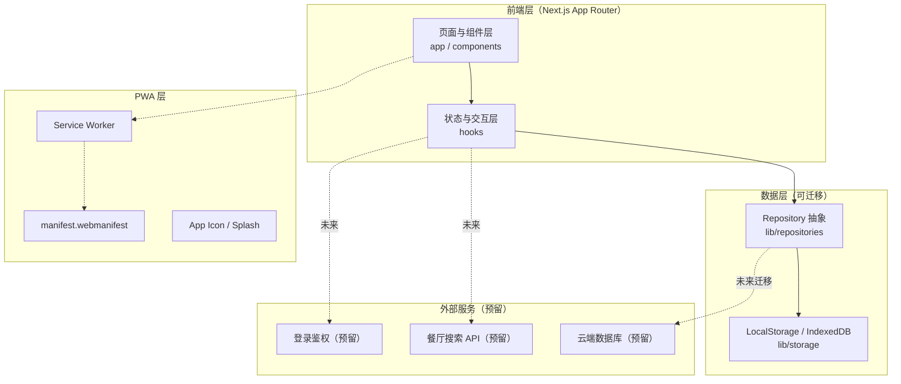
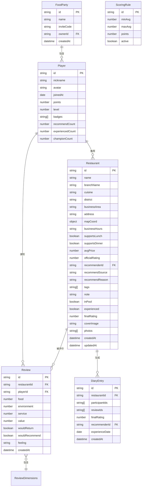

# Lucky Bite 技术架构文档

## 1. 架构设计



**核心架构原则**：
- **组件化**：每个模块独立目录（capsule / restaurant / player / ranking / diary / review / filter / common），禁止单文件巨石
- **数据抽象**：所有数据通过 Repository 接口访问，V1 落地为 LocalStorage/IndexedDB，未来可替换为云端 DB
- **类型安全**：所有数据模型用 TypeScript 类型定义在 `types/`
- **数据源统一**：餐厅/玩家/评价/排行榜数据全部从统一数据源获取，禁止在组件中写死

## 2. 技术说明

- **前端框架**：Next.js 14+（App Router）+ React 18 + TypeScript 5
- **样式**：Tailwind CSS 3 + shadcn/ui（基于 Radix UI 的圆角组件）
- **动画**：Framer Motion（页面切换、扭蛋动画、卡片飞入、星级点亮等）
- **图标**：lucide-react（统一图标库，不混用）
- **字体**：LXGW WenKai / 阿里巴巴普惠体（通过 next/font 加载）
- **状态管理**：React Context + Hooks（轻量），数据层用 Repository 模式
- **本地存储**：IndexedDB（通过 `idb` 库封装）+ LocalStorage（小数据/配置）
- **PWA**：`next-pwa` 或手写 Service Worker + manifest
- **初始化工具**：`create-next-app`（App Router + TypeScript + Tailwind）

**为何选 IndexedDB 而非纯 LocalStorage**：餐厅/评价/日记数据量可能较大且结构化，IndexedDB 支持索引查询，更适合未来迁移到云端数据库的 Repository 模式。

## 3. 目录结构

```
lucky-bite/
├── app/                          # Next.js App Router 路由
│   ├── layout.tsx                # 根布局（字体/Provider/PWA）
│   ├── page.tsx                  # 首页游戏大厅
│   ├── globals.css               # 全局样式 + Tailwind
│   ├── restaurant/
│   │   ├── new/page.tsx          # 新增餐厅
│   │   └── [id]/edit/page.tsx    # 编辑餐厅
│   ├── party/page.tsx            # Food Party 小队管理
│   ├── player/[id]/page.tsx      # 玩家资料
│   ├── ranking/page.tsx          # 排行榜
│   ├── diary/page.tsx            # 美食日记
│   └── review/[restaurantId]/page.tsx  # 评价页
├── components/
│   ├── capsule/                  # 扭蛋机组件
│   │   ├── CapsuleMachine.tsx
│   │   ├── CapsuleAnimation.tsx
│   │   └── CapsuleResult.tsx
│   ├── restaurant/               # 餐厅组件
│   │   ├── RestaurantCard.tsx
│   │   ├── RestaurantCardColumn.tsx
│   │   ├── RestaurantDetailPanel.tsx
│   │   ├── RestaurantForm.tsx
│   │   ├── RestaurantSearch.tsx
│   │   └── TagSelector.tsx
│   ├── player/                   # 玩家组件
│   │   ├── PlayerCard.tsx
│   │   ├── PlayerProfile.tsx
│   │   ├── PartyManager.tsx
│   │   └── AvatarPicker.tsx
│   ├── ranking/                  # 排行榜组件
│   │   ├── RankingList.tsx
│   │   ├── ChampionPodium.tsx
│   │   └── RankingTabs.tsx
│   ├── diary/                    # 美食日记组件
│   │   ├── DiaryTimeline.tsx
│   │   └── DiaryEntry.tsx
│   ├── review/                   # 评价组件
│   │   ├── StarRating.tsx
│   │   ├── ReviewForm.tsx
│   │   └── KeepOrRemoveDialog.tsx
│   ├── filter/                   # 筛选组件
│   │   └── MoodFilterPanel.tsx
│   ├── common/                   # 通用组件
│   │   ├── DynamicBackground.tsx
│   │   ├── FloatingButton.tsx
│   │   ├── ConfirmDialog.tsx
│   │   ├── PageTransition.tsx
│   │   └── PastelCard.tsx
│   └── ui/                       # shadcn/ui 组件
├── data/                         # 静态数据与种子
│   ├── seedRestaurants.ts        # 示例餐厅（仅首次启动）
│   ├── tags.ts                   # 默认标签
│   └── scoringRules.ts           # 默认积分规则
├── hooks/                        # 自定义 Hooks
│   ├── useRestaurants.ts
│   ├── usePlayers.ts
│   ├── useReviews.ts
│   ├── useRanking.ts
│   ├── useDiary.ts
│   ├── useParty.ts
│   └── useCapsule.ts
├── lib/                          # 核心库
│   ├── repositories/             # 数据仓库抽象
│   │   ├── restaurantRepository.ts
│   │   ├── playerRepository.ts
│   │   ├── reviewRepository.ts
│   │   ├── diaryRepository.ts
│   │   └── index.ts              # Repository 工厂
│   ├── storage/                  # 存储适配层
│   │   ├── indexedDB.ts          # idb 封装
│   │   └── localStorage.ts
│   ├── scoring.ts                # 积分计算
│   ├── search.ts                 # 模糊搜索（拼音/中英）
│   └── utils.ts
├── types/                        # TypeScript 类型
│   ├── restaurant.ts
│   ├── player.ts
│   ├── review.ts
│   ├── diary.ts
│   ├── party.ts
│   └── index.ts
├── utils/                        # 工具函数
│   ├── pinyin.ts                 # 拼音转换
│   ├── id.ts                     # 生成唯一 ID
│   └── date.ts
├── public/
│   ├── manifest.webmanifest
│   ├── icons/                    # PWA 图标 192/512/maskable
│   ├── splash/                   # 启动画面
│   └── sw.js                     # Service Worker
└── styles/
    └── animations.css            # 通用动画关键帧
```

## 4. 路由定义

| 路由 | 页面 | 用途 |
|------|------|------|
| `/` | 首页（游戏大厅） | 动态背景 + 左右餐厅卡滚动 + 中央扭蛋机 + 今日冠军 + 右下角 FAB |
| `/restaurant/new` | 新增餐厅 | 智能模糊搜索 + 手动创建表单 |
| `/restaurant/[id]/edit` | 编辑餐厅 | 全字段编辑 |
| `/party` | Food Party | 创建/加入小队、邀请码、成员管理 |
| `/player/[id]` | 玩家资料 | 头像/昵称/等级/徽章/历史/收藏 |
| `/ranking` | 排行榜 | 周/月/季/全部切换 + 领奖台 |
| `/diary` | 美食日记 | 手账风时间轴 |
| `/review/[restaurantId]` | 评价页 | 四维星级 + 是否再来/推荐 + 文字 |

> 餐厅详情、扭蛋动画、筛选浮层、删除确认等以**浮层/全屏遮罩**形式在首页内呈现，不单独开路由（保证游戏感连续性）。

## 5. API 定义

V1 无后端 API，所有数据通过本地 Repository 访问。以下为 Repository 接口契约（TypeScript），未来可替换为 HTTP 客户端实现。

```typescript
// lib/repositories/restaurantRepository.ts
export interface RestaurantRepository {
  list(filter?: RestaurantFilter): Promise<Restaurant[]>;
  getById(id: string): Promise<Restaurant | null>;
  listInPool(): Promise<Restaurant[]>;        // 仅在扭蛋池中的餐厅
  create(data: NewRestaurantInput): Promise<Restaurant>;
  update(id: string, data: Partial<Restaurant>): Promise<Restaurant>;
  softDelete(id: string): Promise<void>;     // 标记移出扭蛋池
  hardDelete(id: string): Promise<void>;     // 永久删除
  favorite(id: string, fav: boolean): Promise<void>;
}

export interface PlayerRepository {
  list(): Promise<Player[]>;
  getById(id: string): Promise<Player | null>;
  create(data: NewPlayerInput): Promise<Player>;
  update(id: string, data: Partial<Player>): Promise<Player>;
  addPoints(id: string, delta: number): Promise<void>;
  recordChampion(id: string): Promise<void>;
}

export interface ReviewRepository {
  listByRestaurant(restaurantId: string): Promise<Review[]>;
  listByPlayer(playerId: string): Promise<Review[]>;
  create(data: NewReviewInput): Promise<Review>;
}

export interface DiaryRepository {
  list(): Promise<DiaryEntry[]>;
  createFromExperience(restaurantId: string, reviewIds: string[]): Promise<DiaryEntry>;
}

export interface PartyRepository {
  getCurrent(): Promise<FoodParty | null>;
  create(data: NewPartyInput): Promise<FoodParty>;
  joinByCode(code: string, player: NewPlayerInput): Promise<FoodParty>;
  addMember(partyId: string, playerId: string): Promise<void>;
}
```

## 6. 数据模型

### 6.1 数据模型 ER 图



### 6.2 数据定义语言（IndexedDB Schema + TypeScript 类型）

**IndexedDB Object Stores**（V1）：

```typescript
// types/restaurant.ts
export interface Restaurant {
  id: string;
  name: string;
  branchName?: string;
  cuisine: string;
  district: string;
  businessArea?: string;
  address: string;
  mapCoord?: { lat: number; lng: number };
  businessHours: string;
  supportsLunch: boolean;
  supportsDinner: boolean;
  avgPrice: number;
  officialRating?: number;
  recommenderId: string;
  recommendSource?: string;
  recommendReason?: string;
  tags: string[];
  note?: string;
  inPool: boolean;
  experienced: boolean;
  finalRating?: number;
  coverImage?: string;
  photos: string[];
  createdAt: string;
  updatedAt: string;
  // 预留扩展字段
  [key: string]: unknown;
}

// types/player.ts
export interface Player {
  id: string;
  nickname: string;
  avatar: string;
  joinedAt: string;
  points: number;
  level: number;
  badges: string[];
  recommendCount: number;
  experiencedCount: number;
  championCount: number;
  favoriteRestaurantIds: string[];
  partyId?: string;
}

// types/review.ts
export interface ReviewDimensions {
  food: number;       // 1-5
  environment: number;
  service: number;
  value: number;
}
export interface Review {
  id: string;
  restaurantId: string;
  playerId: string;
  food: number;
  environment: number;
  service: number;
  value: number;
  wouldReturn: boolean;
  wouldRecommend: boolean;
  feeling?: string;
  createdAt: string;
}

// types/diary.ts
export interface DiaryEntry {
  id: string;
  restaurantId: string;
  participantIds: string[];
  reviewIds: string[];
  finalRating: number;
  recommenderId: string;
  experienceDate: string;
  createdAt: string;
}

// types/party.ts
export interface FoodParty {
  id: string;
  name: string;
  inviteCode: string;
  ownerId: string;
  memberIds: string[];
  createdAt: string;
}

// data/scoringRules.ts
export interface ScoringRule {
  id: string;
  minAvg: number;   // 评分区间下限（含）
  maxAvg: number;   // 评分区间上限（含）
  points: number;   // 推荐人获得积分（可为负）
  active: boolean;
}
// 默认规则（可被覆盖）：
// 5★ → +10, 4★ → +7, 3★ → +3, 2★ → -2, 1★ → -5
```

**IndexedDB 初始化**（`lib/storage/indexedDB.ts`）：

```typescript
// 伪代码示意
const DB_NAME = 'lucky-bite';
const DB_VERSION = 1;
const stores = [
  { name: 'restaurants', keyPath: 'id', indexes: [['inPool'], ['recommenderId'], ['district']] },
  { name: 'players', keyPath: 'id', indexes: [['partyId']] },
  { name: 'reviews', keyPath: 'id', indexes: [['restaurantId'], ['playerId']] },
  { name: 'diary', keyPath: 'id', indexes: [['experienceDate']] },
  { name: 'parties', keyPath: 'id', indexes: [['inviteCode']] },
  { name: 'scoringRules', keyPath: 'id' },
];
```

## 7. 关键模块设计

### 7.1 扭蛋机动画时序（约 3s）

| 阶段 | 时长 | 动画 |
|------|------|------|
| 1. 发光 | 400ms | 扭蛋机玻璃球亮度提升 + 光晕扩散 |
| 2. 摇动 | 600ms | 机身左右晃动（rotate ±3deg） |
| 3. 扭蛋旋转 | 500ms | 内部彩色扭蛋球旋转加速 |
| 4. 掉落 | 500ms | 一颗扭蛋沿轨道下落到出口 |
| 5. 打开 | 500ms | 扭蛋裂开 + 闪光 + 餐厅卡弹出 |
| 6. 庆祝 | 500ms | 彩带/confetti + 中奖餐厅卡放大展示 |

使用 Framer Motion 的 `AnimatePresence` + `keyframes` 实现，支持中途状态展示「✨ 幸运正在路上…」。

### 7.2 积分计算（可配置）

```typescript
// lib/scoring.ts
export function computeRecommenderPoints(avgRating: number, rules: ScoringRule[]): number {
  const rule = rules.find(r => r.active && avgRating >= r.minAvg && avgRating <= r.maxAvg);
  return rule?.points ?? 0;
}
export function computeFinalRating(reviews: Review[]): number {
  if (reviews.length === 0) return 0;
  const allDims = reviews.flatMap(r => [r.food, r.environment, r.service, r.value]);
  return allDims.reduce((a, b) => a + b, 0) / allDims.length;
}
```

### 7.3 模糊搜索（中文/拼音/英文/关键词/连锁）

```typescript
// lib/search.ts
// 使用 pinyin-pro 转换中文为拼音，对名称、菜系、标签、地址做多字段加权匹配
// 返回 top N 结果，命中后自动填充 Restaurant 字段
```

### 7.4 PWA 配置

- `public/manifest.webmanifest`：name/short_name/icons(192/512/maskable)/start_url/display:standalone/theme_color:#A8D8F0/background_color:#FFF8EC
- `public/sw.js`：缓存 app shell + 静态资源，离线可访问首页与已加载数据
- App Icon 与 Splash：使用 pastel 扭蛋图案
- 通过 `next/font` 加载中文字体，保证 PWA 离线可用

## 8. 响应式断点

| 断点 | 宽度 | 布局 |
|------|------|------|
| `sm` | <640px（手机竖屏） | 单列，扭蛋机居中，餐厅卡顶部横向滚动 |
| `md` | 640-768px（手机横屏） | 紧凑两列 |
| `lg` | 768-1024px（iPad） | 两列（餐厅卡列收窄） |
| `xl` | ≥1024px（桌面） | 三列（左卡 + 中扭蛋机 + 右卡） |

## 9. 动画规范

| 场景 | 时长 | 缓动 | 实现 |
|------|------|------|------|
| 页面切换 | 300ms | easeInOut | Framer Motion `AnimatePresence` + 渐隐/滑入 |
| 卡片飞入中央 | 400ms | spring | Framer Motion `layoutId` |
| 按钮点击缩小 | 100ms | easeOut | `whileTap={{ scale: 0.95 }}` |
| 扭蛋动画总时长 | ~3000ms | 见 7.1 | Framer Motion keyframes |
| 星级逐颗点亮 | 80ms/颗 间隔 | spring | stagger |
| 评分数字增长 | 600ms | easeOut | `animate` count up |
| 排行榜冠军上升 | 500ms | spring | 皇冠 + 彩带 confetti |
| 删除卡片缩小淡出 | 400ms | easeIn | `AnimatePresence` exit |
| 背景漂浮 | 20-40s linear infinite | linear | CSS keyframes |
| 餐厅卡列滚动 | 30-60s linear infinite | linear | CSS keyframes + duplicate |

## 10. 扩展性预留

- **Repository 接口**：未来替换为 HTTP 客户端即可对接云端 DB
- **ScoringRule 表**：积分规则可后台修改，不写死
- **Restaurant `[key: string]: unknown`**：允许字段扩展
- **预留 hooks**：`useWeather`、`useAIRecommend`、`useMapMode` 等接口位
- **登录鉴权**：Player 模型预留 `authProvider` 字段位
